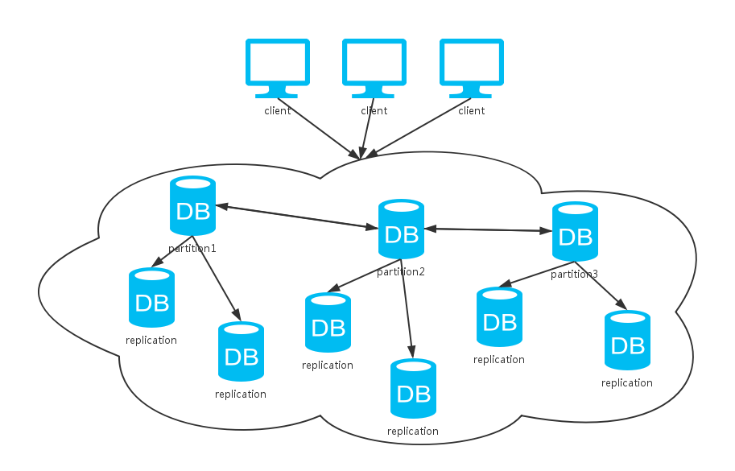
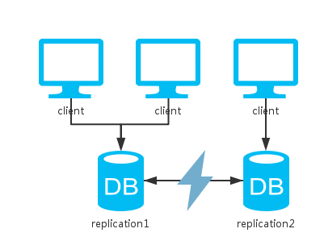
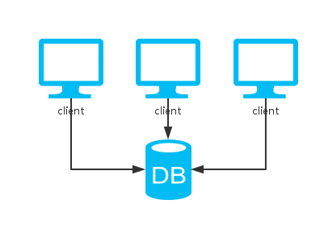
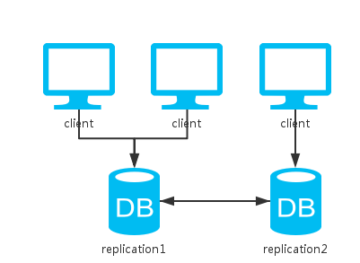
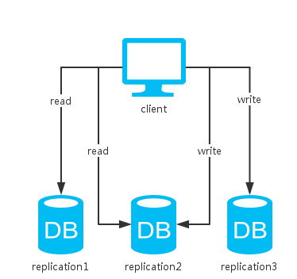
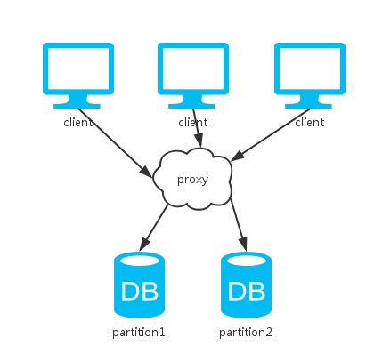
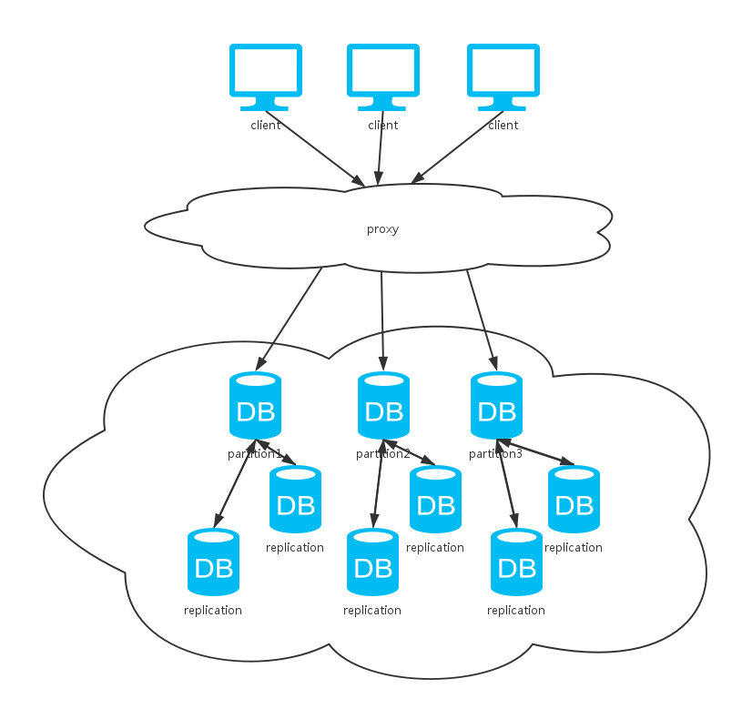

# 文章摘要
谈及一些分布式系统的理论和思想，包括***CAP、BASE、NWR***等。并简单分析一些主流数据库分布式方案的利弊，以便我们在开发时更深入全面地进行思考、选择和设计。

# 文章正文
在讨论常见架构前，先简单了解下**CAP**理论：  

  CAP 是 Consistency、Availablity 和 Partition-tolerance 的缩写。分别是指：  

1.	一致性（Consistency）：每次读操作都能保证返回的是最新数据；
2.	可用性（Availablity）：任何一个没有发生故障的节点，会在合理的时间内返回一个正常的结果；
3.	分区容忍性（Partition-tolerance）：当节点间出现网络分区，照样可以提供服务。  

CAP理论指出：CAP三者只能取其二，不可兼得。其实这一点很好理解：  

*	首先，单机系统都只能保证CP。
*	有两个或以上节点时，当网络分区发生时，集群中两个节点不能互相通信。此时如果保证数据的一致性C，那么必然会有一个节点被标记为不可用的状态，违反了可用性A的要求，只能保证CP。
*	反之，如果保证可用性A，即两个节点可以继续各自处理请求，那么由于网络不通不能同步数据，必然又会导致数据的不一致，只能保证AP。

# 一、单实例
单机系统很显然，只能保证CP，牺牲了可用性A。单机版的MySQL，Redis，MongoDB等数据库都是这种模式。  

实际中，我们需要一套可用性高的系统，即使部分机器挂掉之后仍然可以继续提供服务。

# 二、多副本
  

相比于单实例，这里多了一个节点去备份数据。  

对于读操作来说，因为可以访问两个节点中的任意一个，所以可用性提升。  

对于写操作来说，根据更新策略分为三种情况：  

1.	同步更新：即写操作需要等待两个节点都更新成功才返回。这样的话如果一旦发生网络分区故障，写操作便不可用，牺牲了A。
2.	异步更新：即写操作直接返回，不需要等待节点更新成功，节点异步地去更新数据。  
这种方式，牺牲了C来保证A。即无法保证数据是否更新成功，还有可能会由于网络故障等原因，导致数据不一致。
3.	折衷：更新部分节点成功后便返回。  
	这里，先介绍下类Dynamo系统用于控制分布式存储系统中的一致性级别的策略——***NWR***：  

	*	N：同一份数据的副本个数
	*	W：写操作需要确保成功的副本个数
	*	R：读操作需要读取的副本个数  

	当W+R>N时，由于读写操作覆盖到的副本集肯定会有交集，读操作只要比较副本集数据的修改时间或者版本号即可选出最新的，所以系统是强一致性的；  
	反之，当W+R<=N时是弱一致性的。  

	如：(N,W,R)=(1,1,1)为单机系统，是强一致性的；(N,W,R)=(2,1,1)为常见的master-slave模式，是弱一致性的。

## 举例：
*	如像Cassandra中的折衷型方案`QUORUM`，只要超过半数的节点更新成功便返回，读取时返回多数副本的一致的值。然后，对于不一致的副本，可以通过read repair的方式解决。  

	`read repair`：读取某条数据时，查询所有副本中的这条数据，比较数据与大多数副本的最新数据是否一致，若否，则进行一致性修复。  

	其中，W+R>N，故而是强一致性的。

*	又如Redis的master-slave模式，更新成功一个节点即返回，其他节点异步地去备份数据。这种方式只保证了最终一致性。  

	`最终一致性`：相比于数据时刻保持一致的强一致性，最终一致性允许某段时间内数据不一致。但是随着时间的增长，数据最终会到达一致的状态。  

	其中，W+R<N，所以只能保证最终一致性。  

	此外，N越大，数据可靠性越好。但是由于W或R越大，写或读开销越大，性能越差，所以一般需要综合考虑一致性、可用性和读写性能，设置 W、R 都为 N/2 + 1。

***其实，折衷方案和异步更新的方式从本质上来说是一样的，都是损失一定的C来换取A的提高。而且，会产生‘脑裂’的问题——即网络分区时节点各自处理请求，无法同步数据，当网络恢复时，导致不一致。***  

一般的，数据库都会提供分区恢复的解决方案：  

1.	从源头解决：如设定节点通信的超时时间，超时后‘少数派’节点不提供服务。这样便不会出现数据不一致的情况，不过可用性降低。
2.	从恢复解决：如在通信恢复时，对不同节点的数据进行比较、合并，这样可用性得到了保证。但是在恢复完成之前，数据是不一致的，而且可能出现数据冲突。  

光这样还不够，当数据量较大时，由于一台机器的资源有限并不能容纳所有的数据，我们会想把数据分到好几台机器上存储。

# 三、分片
  

相比于单实例，这里多了一个节点去分割数据。  

由于所有数据都只有一份，一致性得以保证；节点间不需要通信，分区容忍性也有。  

然而，当任意一个节点挂掉，丢失了一部分的数据，系统可用性得不到保证。  

综上，这和单机版的方案一样，都只能保证CP。  

那么，有那些好处呢？  

1.	某个节点挂掉只会影响部分服务，即服务降级；
2.	由于分片了数据，可以均衡负载；
3.	数据量增大／减小后可以相应地扩容／缩容。
	
大多数的数据库服务都提供了分片的功能。如Redis的slots，Cassandra的partitions，MongoDB的shards等。

基于分片解决了数据量大的问题，可是我们还是希望我们的系统是高可用的，那么，如何牺牲一定的一致性去保证可用性呢？

# 四、集群
  

可以看到，上面这种方式综合了前两种方式。同上分析，采用不同的数据同步策略，系统的CAP保证各有不同。不过，一般数据库系统都会提供可选的配置，我们根据不同的场景选择不同的策略以实现不同的特性。  

其实，对于大多数的非金融类互联网公司，要求并非强一致性，而是可用性和最终一致性的保证。这也是NoSQL流行于互联网应用的一大原因，相比于强一致性系统的***ACID***原则，它更加倾向于***BASE***：  

*	`Basically Available`: 基本可用，即允许分区失败，出了问题仅服务降级；
*	`Soft-state`: 软状态，即允许异步；
*	`Eventual Consistency`: 最终一致性，允许数据最终一致，而不是时刻一致。

# 五、总结
基本上，上面讨论的几种方式已经涵盖了大多数的分布式存储系统了。我们可以看到，这些个方案总是需要通过牺牲一部分去换取另一部分，总没法达到100%的CAP。  

选择哪种方案，依据就是在特定场景下，究竟哪些特性是更加重要的了。
